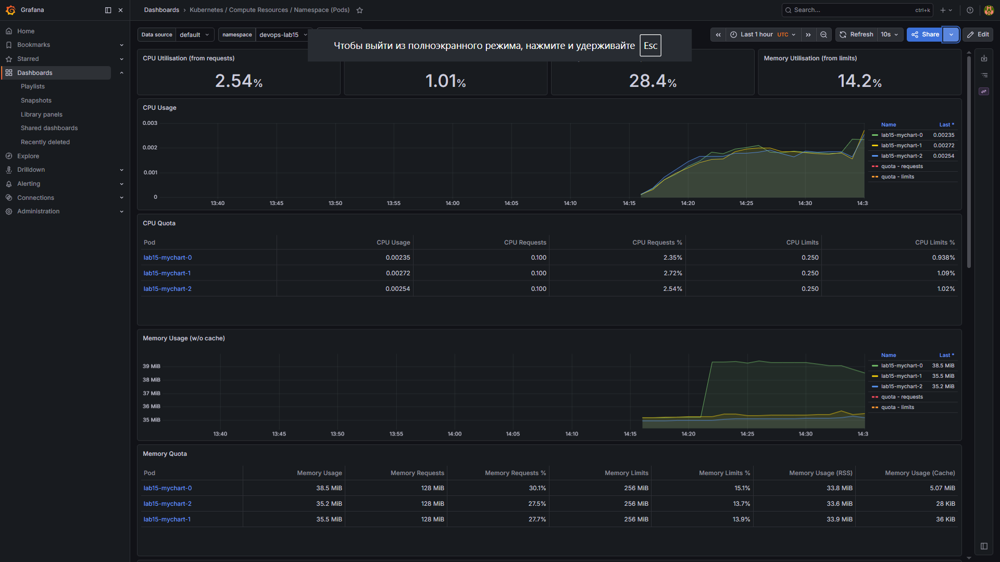
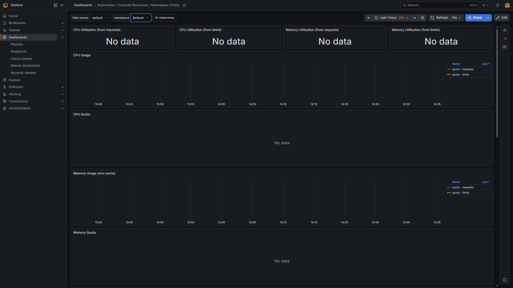
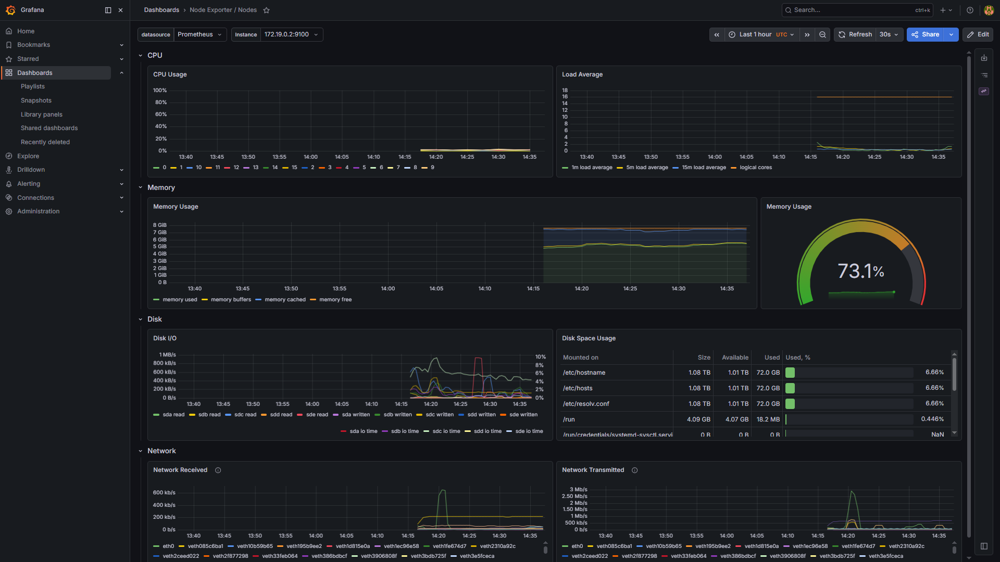
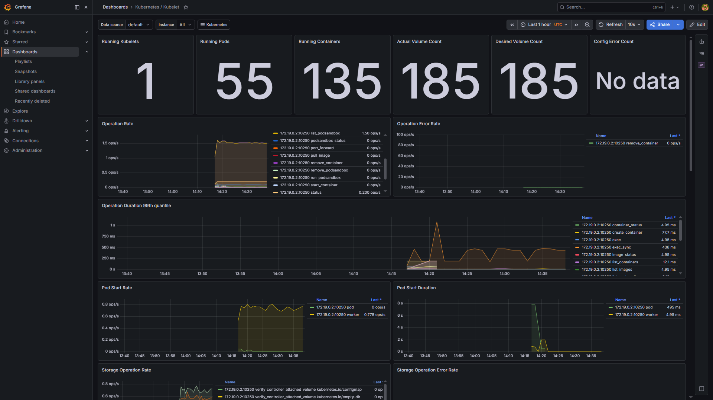
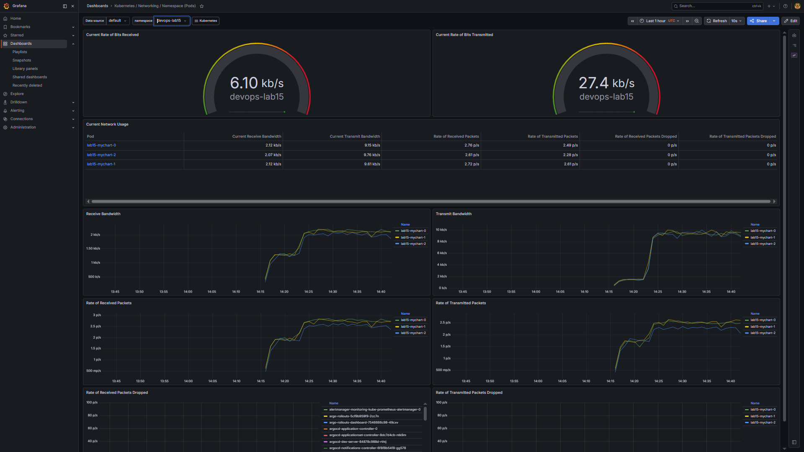
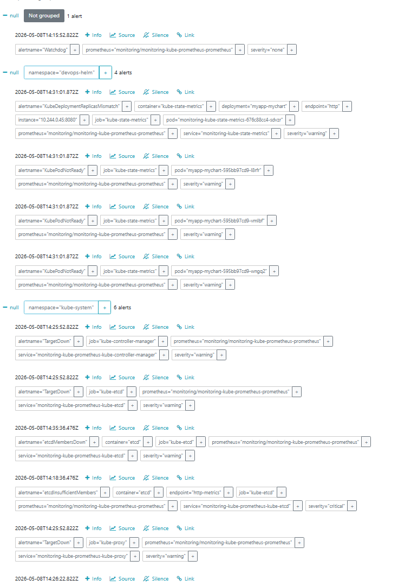
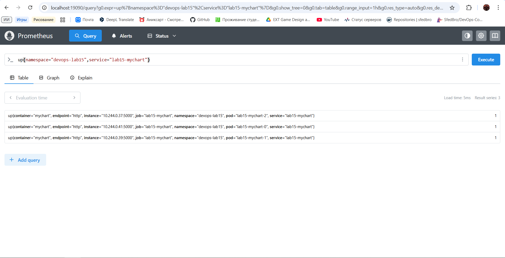

# Lab 16 - Kubernetes Monitoring and Init Containers

Raw command output is also saved in [lab16_runtime.txt](./docs/lab16_runtime.txt).

## Stack Components

- Prometheus Operator: watches monitoring CRDs such as `Prometheus`, `Alertmanager`, `ServiceMonitor`, and generates the runtime Prometheus configuration.
- Prometheus: scrapes Kubernetes and application metrics, stores time-series data, and answers PromQL queries.
- Alertmanager: receives firing alerts from Prometheus and groups/routes them.
- Grafana: provides prebuilt dashboards for cluster, pod, node, kubelet, network, and Alertmanager metrics.
- kube-state-metrics: exposes Kubernetes object state as metrics, for example pod readiness, deployments, StatefulSets, and PVC state.
- node-exporter: exposes host-level node metrics such as CPU, memory, filesystem, and network usage.

## Installation Evidence

Installed with Helm:

```powershell
helm repo add prometheus-community https://prometheus-community.github.io/helm-charts
helm repo update
helm upgrade --install monitoring prometheus-community/kube-prometheus-stack `
  --version 84.5.0 `
  --namespace monitoring `
  --create-namespace `
  --set grafana.adminPassword=prom-operator `
  --set prometheus.prometheusSpec.retention=2d `
  --wait `
  --timeout 10m
```

Release evidence:

```text
COMMAND: helm list -n monitoring
NAME       NAMESPACE   REVISION   STATUS     CHART                         APP VERSION
monitoring monitoring  2          deployed   kube-prometheus-stack-84.5.0   v0.90.1
```

Resource evidence:

```text
COMMAND: kubectl get po,svc -n monitoring -o wide
NAME                                                         READY   STATUS    RESTARTS   AGE
pod/alertmanager-monitoring-kube-prometheus-alertmanager-0   2/2     Running   0          6m44s
pod/monitoring-grafana-56db8cb454-78fvh                      3/3     Running   0          6m55s
pod/monitoring-kube-prometheus-operator-7fdc7f994c-dmvc4     1/1     Running   0          6m55s
pod/monitoring-kube-state-metrics-676c88cc4-sdvzr            1/1     Running   0          6m55s
pod/monitoring-prometheus-node-exporter-xdhzd                1/1     Running   0          6m55s
pod/prometheus-monitoring-kube-prometheus-prometheus-0       2/2     Running   0          6m44s

NAME                                              TYPE        CLUSTER-IP      PORT(S)
service/monitoring-grafana                        ClusterIP   10.96.165.103   80/TCP
service/monitoring-kube-prometheus-alertmanager   ClusterIP   10.96.199.173   9093/TCP,8080/TCP
service/monitoring-kube-prometheus-prometheus     ClusterIP   10.96.104.81    9090/TCP,8080/TCP
service/monitoring-kube-state-metrics             ClusterIP   10.96.25.210    8080/TCP
service/monitoring-prometheus-node-exporter       ClusterIP   10.96.132.67    9100/TCP
```

CRD evidence:

```text
COMMAND: kubectl get prometheus,alertmanager -n monitoring
NAME                                                                     VERSION   DESIRED   READY   RECONCILED   AVAILABLE
prometheus.monitoring.coreos.com/monitoring-kube-prometheus-prometheus   v3.11.3   1         1       True         True

NAME                                                                         VERSION   REPLICAS   READY   RECONCILED   AVAILABLE
alertmanager.monitoring.coreos.com/monitoring-kube-prometheus-alertmanager   v0.32.1   1          1       True         True
```

Access commands:

```powershell
kubectl port-forward svc/monitoring-grafana -n monitoring 13000:80
kubectl port-forward svc/monitoring-kube-prometheus-alertmanager -n monitoring 9093:9093
kubectl port-forward svc/monitoring-kube-prometheus-prometheus -n monitoring 19090:9090
```

Grafana credentials:

```text
username: admin
password: prom-operator
```

## Dashboard Answers

These values were queried from Prometheus, which is the datasource used by the Grafana dashboards.

### 1. StatefulSet Pod Resources

Dashboard: `Kubernetes / Compute Resources / Namespace (Pods)`

Namespace: `devops-lab15`

PromQL:

```promql
sum by (pod) (rate(container_cpu_usage_seconds_total{namespace="devops-lab15",pod=~"lab15-mychart-[0-9]+",container!="",image!=""}[5m]))
sum by (pod) (container_memory_working_set_bytes{namespace="devops-lab15",pod=~"lab15-mychart-[0-9]+",container!="",image!=""}) / 1024 / 1024
```

Evidence:

```text
CPU cores:
pod=lab15-mychart-0 => 0.0016723325607857545
pod=lab15-mychart-2 => 0.0015927530456056676
pod=lab15-mychart-1 => 0.001550936156344943

Memory MiB:
pod=lab15-mychart-0 => 39.359375
pod=lab15-mychart-2 => 35.07421875
pod=lab15-mychart-1 => 35.3359375
```

Screenshot to add:

```markdown

```

### 2. Default Namespace CPU Analysis

Dashboard: `Kubernetes / Compute Resources / Namespace (Pods)`

Namespace: `default`

The local `default` namespace has no pods, so there is no most/least CPU consumer.

Evidence:

```text
COMMAND: kubectl get pods -n default
No resources found in default namespace.

PromQL: sum by (pod) (rate(container_cpu_usage_seconds_total{namespace="default",pod!="",container!="",image!=""}[5m]))
Result: <no series>
```

Screenshot to add:

```markdown

```

### 3. Node Metrics

Dashboard: `Node Exporter / Nodes`

PromQL:

```promql
100 * (1 - (node_memory_MemAvailable_bytes / node_memory_MemTotal_bytes))
(node_memory_MemTotal_bytes - node_memory_MemAvailable_bytes) / 1024 / 1024
machine_cpu_cores
```

Evidence:

```text
Memory usage: 70.28101658157458%
Memory used: 5486.375 MiB
CPU cores: 16
```

Screenshot to add:

```markdown

```

### 4. Kubelet Pods and Containers

Dashboard: `Kubernetes / Kubelet`

PromQL:

```promql
kubelet_running_pods
kubelet_running_containers
```

Evidence:

```text
kubelet_running_pods => 55
kubelet_running_containers{container_state="created"} => 1
kubelet_running_containers{container_state="exited"} => 75
kubelet_running_containers{container_state="running"} => 59
```

Screenshot to add:

```markdown

```

### 5. Pod Network Metrics

Dashboard: `Kubernetes / Networking / Namespace (Pods)`

Namespace: `devops-lab15`

The `default` namespace has no running application pods in this cluster, so the dashboard evidence uses `devops-lab15`, where the StatefulSet pods are running and producing network traffic.

PromQL:

```promql
sum by (pod) (rate(container_network_receive_bytes_total{namespace="devops-lab15",pod=~"lab15-mychart-[0-9]+"}[5m]))
sum by (pod) (rate(container_network_transmit_bytes_total{namespace="devops-lab15",pod=~"lab15-mychart-[0-9]+"}[5m]))
```

Evidence:

```text
devops_lab15_network_receive_Bps:
pod=lab15-mychart-0 => 270.103353520992
pod=lab15-mychart-1 => 261.1997043355862
pod=lab15-mychart-2 => 253.74754687043304

devops_lab15_network_transmit_Bps:
pod=lab15-mychart-0 => 1149.4912340930568
pod=lab15-mychart-1 => 1189.630375377535
pod=lab15-mychart-2 => 1129.1755582818498
```

Screenshot to add:

```markdown

```

### 6. Alerts

Dashboard: `Alertmanager / Overview`

PromQL:

```promql
ALERTS{alertstate="firing"}
```

Evidence:

```text
Firing alerts: 11
alertname=Watchdog,severity=none => 1
alertname=TargetDown,namespace=kube-system,severity=warning => 4
alertname=KubePodNotReady,namespace=devops-helm,severity=warning => 3
alertname=KubeDeploymentReplicasMismatch,namespace=devops-helm,severity=warning => 1
alertname=etcdMembersDown,namespace=kube-system,severity=warning => 1
alertname=etcdInsufficientMembers,severity=critical => 1
```

Screenshot to add:

```markdown

```

## Init Containers

Implementation:

- [lab16-init-demo.yaml](./init-containers/lab16-init-demo.yaml)
- Namespace: `devops-lab16`
- Source service: `init-source`
- Init container `wait-for-service`: waits until `init-source` is reachable.
- Init container `init-download`: uses `wget` to download `/index.html` into `/work-dir`.
- Main container `main-app`: mounts the same `emptyDir` at `/data` and reads `/data/index.html`.

Apply command:

```powershell
kubectl apply -f k8s/init-containers/lab16-init-demo.yaml
kubectl rollout status deployment/init-source -n devops-lab16 --timeout=180s
kubectl wait --for=condition=Ready pod/init-demo -n devops-lab16 --timeout=180s
```

Resource evidence:

```text
COMMAND: kubectl get all -n devops-lab16 -o wide
NAME                               READY   STATUS    RESTARTS   AGE
pod/init-demo                      1/1     Running   0          4m35s
pod/init-source-7b9dfc57d8-88mvj   1/1     Running   0          4m35s

NAME                  TYPE        CLUSTER-IP    PORT(S)
service/init-source   ClusterIP   10.96.46.67   8080/TCP

NAME                          READY   UP-TO-DATE   AVAILABLE
deployment.apps/init-source   1/1     1            1
```

Wait-for-service evidence:

```text
COMMAND: kubectl logs init-demo -n devops-lab16 -c wait-for-service
wget: can't connect to remote host (10.96.46.67): Connection refused
waiting for init-source service
init-source service is reachable
```

Download evidence:

```text
COMMAND: kubectl logs init-demo -n devops-lab16 -c init-download
Connecting to init-source.devops-lab16.svc.cluster.local:8080 (10.96.46.67:8080)
saving to '/work-dir/index.html'
index.html           100% |********************************|    90  0:00:00 ETA
'/work-dir/index.html' saved
downloaded file:
lab16 init container demo
source: init-source service
destination: shared emptyDir volume
```

Main container proof:

```text
COMMAND: kubectl exec init-demo -n devops-lab16 -c main-app -- cat /data/index.html
lab16 init container demo
source: init-source service
destination: shared emptyDir volume
```

## Bonus: ServiceMonitor

The Python app already exposes `/metrics`, so a ServiceMonitor was added:

- [lab16-app-servicemonitor.yaml](./monitoring/lab16-app-servicemonitor.yaml)

Apply command:

```powershell
kubectl apply -f k8s/monitoring/lab16-app-servicemonitor.yaml
```

ServiceMonitor evidence:

```text
COMMAND: kubectl get servicemonitor lab15-mychart -n monitoring -o yaml
apiVersion: monitoring.coreos.com/v1
kind: ServiceMonitor
metadata:
  labels:
    release: monitoring
  name: lab15-mychart
  namespace: monitoring
spec:
  endpoints:
  - interval: 15s
    path: /metrics
    port: http
  namespaceSelector:
    matchNames:
    - devops-lab15
  selector:
    matchLabels:
      app.kubernetes.io/instance: lab15
      app.kubernetes.io/name: mychart
```

Prometheus scrape evidence:

```text
PromQL: up{namespace="devops-lab15",service="lab15-mychart"}
pod=lab15-mychart-2 => 1
pod=lab15-mychart-0 => 1
pod=lab15-mychart-1 => 1

PromQL: http_requests_total{namespace="devops-lab15",service="lab15-mychart",exported_endpoint="/metrics"}
pod=lab15-mychart-0,status_code=200 => 3
pod=lab15-mychart-1,status_code=200 => 3
pod=lab15-mychart-2,status_code=200 => 2
```

Screenshot to add for bonus:

```markdown

```

## Screenshot Checklist

Open Grafana:

```powershell
kubectl port-forward svc/monitoring-grafana -n monitoring 13000:80
```

Then open `http://localhost:13000`.

Use credentials:

```text
admin / prom-operator
```

Save screenshots under:

```text
k8s/docs/screenshots/lab16_1_grafana_statefulset_resources.png
k8s/docs/screenshots/lab16_2_grafana_default_namespace.png
k8s/docs/screenshots/lab16_3_grafana_node_metrics.png
k8s/docs/screenshots/lab16_4_grafana_kubelet.png
k8s/docs/screenshots/lab16_5_grafana_network_devops_lab15.png
k8s/docs/screenshots/lab16_6_alertmanager_alerts.png
k8s/docs/screenshots/lab16_7_prometheus_app_metrics.png
```
