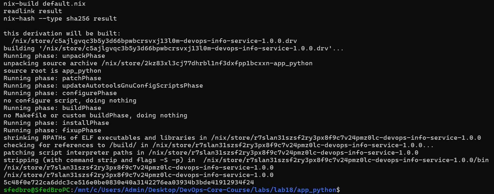
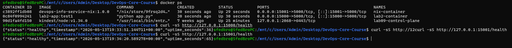

# Lab 18 - Reproducible Builds with Nix

## Environment

Repository path in WSL:

```text
/mnt/c/Users/Admin/Desktop/DevOps-Core-Course
```

Nix installation:

```text
COMMAND: nix --version
nix (Determinate Nix 3.20.0) 2.34.6
```

Basic Nix verification was completed before the lab:

```text
COMMAND: nix run nixpkgs#hello
Hello, world!
```

Application used for the lab:

- Source: `app_python/`
- Lab 18 copy: `labs/lab18/app_python/`
- Runtime: FastAPI on port `5000`
- Health endpoint: `/health`

## Task 1 - Reproducible Python App

### Files Created

- `labs/lab18/app_python/app.py`
- `labs/lab18/app_python/requirements.txt`
- `labs/lab18/app_python/default.nix`

The original Python application from Lab 1-2 was copied into `labs/lab18/app_python/`.

### Nix Derivation

`default.nix` builds a reproducible wrapper for the FastAPI service:

```nix
{ pkgs ? import <nixpkgs> {} }:

let
  python = pkgs.python312.withPackages (ps: with ps; [
    fastapi
    prometheus-client
    uvicorn
  ]);
in
pkgs.stdenv.mkDerivation {
  pname = "devops-info-service";
  version = "1.0.0";
  src = ./.;

  nativeBuildInputs = [ pkgs.makeWrapper ];

  installPhase = ''
    runHook preInstall

    mkdir -p $out/share/devops-info-service $out/bin
    cp app.py requirements.txt $out/share/devops-info-service/

    makeWrapper ${python}/bin/python $out/bin/devops-info-service \
      --add-flags "$out/share/devops-info-service/app.py" \
      --set-default HOST "0.0.0.0" \
      --set-default PORT "5000" \
      --set-default APP_ENV "nix"

    runHook postInstall
  '';
}
```

Why this is reproducible:

- Python version is selected from Nix, not from the host OS.
- Python packages are selected from the pinned Nix package set, not resolved dynamically by `pip`.
- The output path is content-addressed by Nix inputs.
- Build inputs are declared explicitly.

### Build Evidence

```text
COMMAND: nix-build default.nix
/nix/store/r7slan31szsf2ry3px8f9c7v24pmz0lc-devops-info-service-1.0.0

COMMAND: readlink result
/nix/store/r7slan31szsf2ry3px8f9c7v24pmz0lc-devops-info-service-1.0.0

COMMAND: nix-hash --type sha256 result
5c48f0e722ca6ddc3ce516e0be0830e40a3142276ea03934b3bde41912934f24
```

Screenshot:



### Rebuild Evidence

The same derivation was built twice. The store path stayed identical:

```text
COMMAND: rebuild and compare store path
first=/nix/store/r7slan31szsf2ry3px8f9c7v24pmz0lc-devops-info-service-1.0.0
second=/nix/store/r7slan31szsf2ry3px8f9c7v24pmz0lc-devops-info-service-1.0.0
store_paths_match=yes
```

The output was then deleted from the Nix store and rebuilt from scratch:

```text
COMMAND: force rebuild after deleting app store path
delete_target=/nix/store/r7slan31szsf2ry3px8f9c7v24pmz0lc-devops-info-service-1.0.0
1 store paths deleted, 11.4 KiB freed
rebuilt=/nix/store/r7slan31szsf2ry3px8f9c7v24pmz0lc-devops-info-service-1.0.0
```

The rebuilt output path is identical, proving that the same inputs produced the same output.

### Runtime Evidence

The Nix-built application was started with a custom port and queried with `curl`:

```text
COMMAND: run Nix-built app and curl /health
{"status":"healthy","timestamp":"2026-05-13T19:07:19.928853+00:00","uptime_seconds":2}
```

Application logs:

```text
{"timestamp": "2026-05-13T19:07:17.216431+00:00", "level": "INFO", "logger": "uvicorn.error", "message": "Started server process [3126]", "service": "devops-python"}
{"timestamp": "2026-05-13T19:07:17.216650+00:00", "level": "INFO", "logger": "uvicorn.error", "message": "Waiting for application startup.", "service": "devops-python"}
{"timestamp": "2026-05-13T19:07:17.216817+00:00", "level": "INFO", "logger": "devops.python", "message": "application startup", "service": "devops-python", "event": "startup", "host": "127.0.0.1", "port": 15000, "debug": false}
{"timestamp": "2026-05-13T19:07:17.216868+00:00", "level": "INFO", "logger": "uvicorn.error", "message": "Application startup complete.", "service": "devops-python"}
```

### Lab 1 vs Lab 18 Comparison

| Aspect | Lab 1: `pip` + venv | Lab 18: Nix |
|--------|----------------------|-------------|
| Python version | Depends on local system Python | Comes from Nix package set |
| Dependency resolution | Happens at install time with `pip` | Declared in Nix expression |
| Transitive dependencies | Can drift unless fully locked with hashes | Locked by Nix closure |
| Build isolation | Virtual environment, still host-dependent | Nix sandbox and store |
| Rebuild output | No content-addressed output path | Same inputs produce same store path |
| Binary cache | No native content-addressed cache | Nix store and binary caches |

`requirements.txt` is weaker than Nix because it usually pins only direct Python dependencies. Even this project has transitive dependencies such as `starlette`, `pydantic`, `click`, `h11`, and `anyio`; in the traditional workflow those are resolved by `pip` at install time. Nix captures the whole dependency closure and produces a store path from all build inputs.

### Nix Store Path Format

Example:

```text
/nix/store/r7slan31szsf2ry3px8f9c7v24pmz0lc-devops-info-service-1.0.0
```

Meaning:

- `/nix/store`: immutable Nix store root
- `r7slan31szsf2ry3px8f9c7v24pmz0lc`: hash derived from build inputs
- `devops-info-service`: package name
- `1.0.0`: package version

If source code, dependencies, or build instructions change, the hash changes and a new store path is created.

## Task 2 - Reproducible Docker Images

### Files Created

- `labs/lab18/app_python/docker.nix`
- `labs/lab18/app_python/Dockerfile`

The Dockerfile copy represents the Lab 2 traditional container build. The Nix Docker image is built with `dockerTools`.

### Nix Docker Image

`docker.nix`:

```nix
{ pkgs ? import <nixpkgs> {} }:

let
  app = import ./default.nix { inherit pkgs; };
in
pkgs.dockerTools.buildLayeredImage {
  name = "devops-info-service-nix";
  tag = "1.0.0";

  contents = [
    app
    pkgs.cacert
  ];

  config = {
    Cmd = [ "${app}/bin/devops-info-service" ];
    Env = [
      "HOST=0.0.0.0"
      "PORT=5000"
      "APP_ENV=nix-docker"
      "VISITS_FILE=/tmp/devops-info-service/visits"
      "CONFIG_FILE=/config/config.json"
    ];
    ExposedPorts = {
      "5000/tcp" = {};
    };
    WorkingDir = "/";
  };

  created = "1970-01-01T00:00:01Z";
}
```

The fixed `created` timestamp avoids timestamp drift in image metadata.

### Nix Docker Build Evidence

```text
COMMAND: nix-build docker.nix
/nix/store/6dxzl05d424w4sbs3jml0f64hvwa25pw-devops-info-service-nix.tar.gz

COMMAND: sha256sum result
828135cc23d56f24c6328b742ed4052d21b094bb38c879689a0fec911552323a  result
```

Rebuild comparison:

```text
COMMAND: dockerTools image reproducibility
first_result=/nix/store/6dxzl05d424w4sbs3jml0f64hvwa25pw-devops-info-service-nix.tar.gz
first_sha256=828135cc23d56f24c6328b742ed4052d21b094bb38c879689a0fec911552323a
second_result=/nix/store/6dxzl05d424w4sbs3jml0f64hvwa25pw-devops-info-service-nix.tar.gz
second_sha256=828135cc23d56f24c6328b742ed4052d21b094bb38c879689a0fec911552323a
docker_tar_hashes_match=yes
```

### Traditional Dockerfile Comparison

The traditional Dockerfile was built twice with `--no-cache`, then each image was saved and hashed:

```text
COMMAND: build traditional Docker image twice with --no-cache and compare docker save hashes
lab2_test1_sha256=6691df76978715e7809e5d53911e62783b54c08f32939f76caff7ea48a42fd9a
lab2_test2_sha256=64ac3320849e02f6c5bd664f70276d7b12cf21a98c6f5d90e664839497be1cc7
traditional_docker_hashes_match=no
```

The two traditional Docker image tarballs differ even though the Dockerfile and source were the same. Reasons:

- Docker layer metadata includes creation time.
- `apt-get update` reads mutable package indexes.
- `pip install` resolves dependencies from PyPI at build time.
- Docker tags such as `python:3.12-slim` can point to newer image digests over time unless pinned by digest.

### Container Runtime Evidence

The Nix-built image was loaded into Docker:

```text
COMMAND: docker load Nix image
Loaded image: devops-info-service-nix:1.0.0
```

Both containers ran side by side:

```text
COMMAND: run Lab 2 and Nix containers side by side
lab2_container=7f244def2dbd1b60b111c83b54f4927044e917137d64ebbe85faefdcb1133a3e.
nix_container=404c42c46edb640013d96fdb083b771d79730732deaaa0a8235aff856670d4b7.

COMMAND: curl Lab 2 container /health
{"status":"healthy","timestamp":"2026-05-13T19:13:51.119954+00:00","uptime_seconds":2}

COMMAND: curl Nix container /health
{"status":"healthy","timestamp":"2026-05-13T19:13:51.267399+00:00","uptime_seconds":2}
```

Screenshot:



Image size comparison:

```text
COMMAND: docker images sizes
REPOSITORY                 TAG       SIZE
lab2-app                   test2     180MB
lab2-app                   test1     180MB
devops-info-service-nix    1.0.0     229MB
```

In this implementation the Nix image is larger because it includes the Nix store closure for Python and dependencies as image layers. The main benefit demonstrated here is reproducibility, not image minimization.

### Lab 2 vs Lab 18 Docker Comparison

| Aspect | Lab 2 Dockerfile | Lab 18 Nix dockerTools |
|--------|------------------|------------------------|
| Base image | `python:3.12-slim` Docker tag | No mutable Docker base image |
| Dependency install | `pip install -r requirements.txt` during Docker build | Nix dependency closure |
| Timestamps | Vary between builds | Fixed image timestamp |
| Hash result | Different `docker save` SHA256 values | Identical tarball SHA256 values |
| Runtime result | Works | Works |
| Size in this run | 180 MB | 229 MB |
| Reproducibility | Not bit-for-bit reproducible | Bit-for-bit reproducible |

## Bonus - Modern Nix With Flakes

### Files Created

- `labs/lab18/app_python/flake.nix`
- `labs/lab18/app_python/flake.lock`

### Flake Configuration

`flake.nix` exposes:

- `packages.x86_64-linux.default`
- `packages.x86_64-linux.dockerImage`
- `devShells.x86_64-linux.default`

The flake pins `nixpkgs` through `flake.lock`.

### flake.lock Evidence

```text
COMMAND: flake.lock nixpkgs revision
"locked": {
  "lastModified": 1778580735,
  "narHash": "sha256-t+8AVV8ExvOmslz2sLIgw/hJBKlyl65rJvxjvvjHgpE=",
  "owner": "NixOS",
  "repo": "nixpkgs",
  "rev": "48d91f2c0ce7b9e589f967d4f685153dd765dcdd",
  "type": "github"
}
```

### Flake Build Evidence

The flake was built from a native WSL path because `nix flake lock` was very slow on the Windows-mounted `/mnt/c` Git tree.

```text
COMMAND: nix build .#default
/nix/store/6h7vs0p1204jnvir5f8l5nz4h7c4nd66-devops-info-service-1.0.0

COMMAND: nix build .#dockerImage
/nix/store/3j6kfg8c4ncn33dxnj91qnbvcr27l292-devops-info-service-nix.tar.gz
9950b440bd03c9b997224e664ffcedc609b022c6fbc30d62f7715da9476e38c8  result
```

### Dev Shell Evidence

```text
COMMAND: nix develop checks
Python 3.12.13
0.128.0 0.40.0
```

The printed Python package versions are:

- FastAPI `0.128.0`
- Uvicorn `0.40.0`

These versions come from the locked `nixpkgs` revision, not from the host Python environment.

### Lab 10 Helm Values vs Nix Flakes

| Aspect | Lab 10 Helm values | Lab 18 Nix Flakes |
|--------|--------------------|-------------------|
| Locks app deployment config | Yes | Not the focus |
| Locks image tag | Yes, if tag is explicit | Can build and lock the image content |
| Locks Python version | No | Yes |
| Locks Python dependencies | No | Yes through Nix closure |
| Locks build tools | No | Yes |
| Lock format | `values.yaml`, `Chart.lock` for chart deps | `flake.lock` with exact revision and hash |
| Reproducibility guarantee | Deployment-level, tag-based | Build-level, content-addressed |

Helm is still useful for deploying to Kubernetes, but it does not make the application image reproducible by itself. Nix Flakes solve the build reproducibility problem before the image is deployed.

## Challenges And Solutions

### Repository Recovery Experience

Earlier in the course, around Lab 5, I had a repository recovery issue. That experience made this lab feel more serious because losing or accidentally changing project state can make later evidence difficult to trust. I did not treat that as proof that previous labs were invalid, but it did make me more careful in Lab 18: I kept the Nix expressions, command outputs, screenshots, and raw runtime log in the repository so the work can be rebuilt and checked again.

This is also one of the practical reasons reproducible builds matter. If a repository or environment has to be restored, the build should not depend on memory, local machine state, or whatever package versions happen to be current on that day.

### Slow Flake Lock On `/mnt/c`

`nix flake lock` was too slow when executed directly inside the Windows-mounted repository path. The workaround was:

1. Copy `labs/lab18/app_python/` into native WSL path `/tmp/lab18-app-python`.
2. Run `nix flake lock`, `nix build`, and `nix develop` there.
3. Copy the generated `flake.lock` back into the repository.

This does not change the Nix expressions. It only avoids slow Git/filesystem operations on `/mnt/c`.

### Docker CLI In WSL

Docker CLI was not available inside WSL:

```text
The command 'docker' could not be found in this WSL 2 distro.
```

Solution:

- Build Nix image tarball in WSL.
- Copy the tarball to the repository path.
- Use Docker Desktop from Windows PowerShell for `docker load`, `docker build`, `docker run`, and `curl` verification.

## Final Results

| Requirement | Status |
|-------------|--------|
| Nix installed and verified | Done |
| Python app built with Nix | Done |
| Store path reproducibility shown | Done |
| Forced rebuild after deleting store path | Done |
| Nix-built app runtime verified | Done |
| Docker image built with `dockerTools` | Done |
| Nix Docker tarball hash reproducibility shown | Done |
| Traditional Dockerfile non-reproducibility shown | Done |
| Lab 2 and Nix containers tested side by side | Done |
| Flake bonus | Done |
| Dev shell bonus | Done |

## Reflection

This lab made the idea of reproducibility more concrete for me. Earlier in the course I already had a stressful repository recovery situation around Lab 5, and that made me think about how fragile coursework or production work can become when the exact state of files, dependencies, and build steps is not easy to reproduce. Nix addresses that problem by making the build inputs explicit and by producing content-addressed outputs.

Nix would have helped in Lab 1 by removing the dependency on the local Python installation and making the Python dependency tree explicit. It would have helped in Lab 2 by removing mutable Docker build inputs and timestamp drift from the container image. The store path and hash comparisons in this lab are useful because they give evidence that can be checked again later, not just a statement that the build worked once on my machine.

The tradeoff is complexity. Docker and `requirements.txt` are easier to understand at first, while Nix requires learning a new workflow and debugging unfamiliar problems such as flakes on `/mnt/c`. Still, for CI/CD, audits, long-term maintenance, and recovery after mistakes, Nix provides stronger guarantees than `pip`, virtual environments, Dockerfiles, or Helm values alone.
